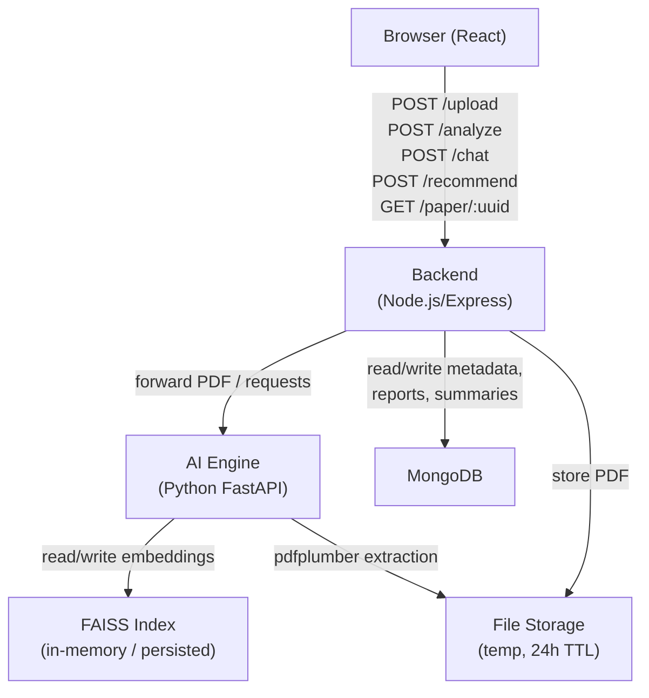
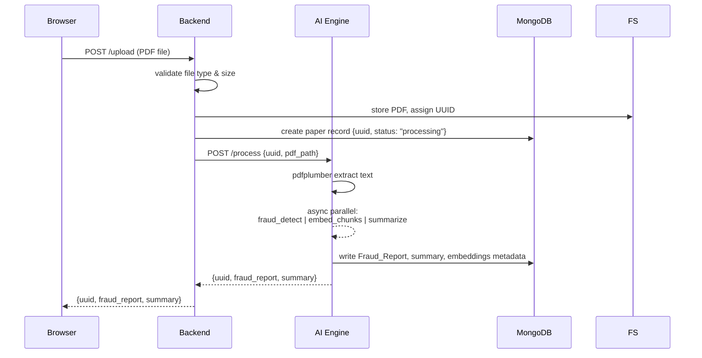

# Design Document: FraudLens

## Overview

FraudLens is a full-stack AI-powered research paper fraud detection and analysis platform. Users upload a PDF, receive a structured fraud detection report (plagiarism score, risk level, flagged issues), interact with the paper via a RAG-based chatbot, and discover related papers through a recommendation engine.

The system is composed of three independently deployable services:

- **Frontend** – React.js SPA served to the user
- **Backend** – Node.js/Express REST API acting as an orchestration layer
- **AI Engine** – Python FastAPI service handling all ML/AI processing

All persistent state lives in MongoDB. The AI Engine uses FAISS for vector search and pdfplumber for PDF text extraction.

### Key Design Goals

- Parallel execution of fraud detection modules to minimize latency
- Clean separation between orchestration (Backend) and AI processing (AI Engine)
- UUID-based paper identity enabling session persistence and retrieval
- Streaming-friendly chatbot responses with source attribution

---

## Architecture



### Request Flow: Paper Upload & Analysis



---

## Components and Interfaces

### Frontend (React.js)

| Component | Responsibility |
|---|---|
| `UploadPage` | File picker (PDF only), upload progress, UUID storage in session |
| `Dashboard` | Tabbed view: Report, Chatbot, Recommendations |
| `FraudReportPanel` | Gauge/progress bar for plagiarism score, risk badge, issues list, highlighted text |
| `ChatPanel` | Message input, scrollable history, source chunk display |
| `RecommendPanel` | Paper cards with title, authors, abstract snippet, similarity score |
| `SummaryPanel` | Displays auto-generated structured summary |

Frontend communicates exclusively with the Backend REST API. No direct calls to the AI Engine.

### Backend (Node.js/Express)

| Endpoint | Method | Description |
|---|---|---|
| `/upload` | POST | Accepts multipart PDF, validates, stores, triggers AI processing |
| `/analyze` | POST | Returns Fraud_Report + summary for a given UUID |
| `/chat` | POST | Proxies chat question to AI Engine, returns answer + sources |
| `/recommend` | POST | Proxies recommendation query to AI Engine |
| `/paper/:uuid` | GET | Returns stored paper metadata, report, and summary |

Middleware:
- `multer` for multipart file handling (20 MB limit, PDF MIME type check)
- Global error handler returning structured JSON errors (no stack traces to client)
- Request body validation (400 on malformed JSON)

### AI Engine (Python FastAPI)

| Endpoint | Method | Description |
|---|---|---|
| `/process` | POST | Full pipeline: extract → detect → embed → summarize (async parallel) |
| `/chat` | POST | RAG Q&A: retrieve chunks → build prompt → LLM answer |
| `/recommend` | POST | Sentence-BERT encode query → cosine similarity → top-10 |

Internal modules:

| Module | Technology | Responsibility |
|---|---|---|
| `PDF_Processor` | pdfplumber | Extract full text from PDF |
| `Plagiarism_Module` | scikit-learn TF-IDF + cosine similarity | Compute plagiarism_score 0–1 |
| `Pattern_Module` | regex + NLTK/spaCy | Detect repeated sentences, overused keywords, structural anomalies |
| `Citation_Module` | regex + heuristics | Extract references, flag format inconsistencies |
| `Fraud_Detector` | asyncio | Orchestrate 3 modules concurrently, produce Fraud_Report |
| `Embedder` | LangChain + FAISS + OpenAI/HuggingFace | Chunk text (512 tokens, 50 overlap), embed, store in FAISS |
| `Chatbot` | LangChain RetrievalQA | Retrieve top-5 chunks, build prompt, call LLM |
| `Recommender` | Sentence-BERT + cosine similarity | Encode query, search pre-indexed corpus |
| `Summarizer` | LangChain + LLM | Generate structured summary (title, contributions, methodology, conclusions) |

---

## Data Models

### MongoDB Collections

#### `papers`

```json
{
  "_id": "ObjectId",
  "uuid": "string (UUID v4)",
  "filename": "string",
  "file_path": "string",
  "status": "processing | completed | failed",
  "uploaded_at": "ISODate",
  "expires_at": "ISODate (uploaded_at + 24h)",
  "extracted_text": "string",
  "summary": {
    "title": "string",
    "main_contributions": "string",
    "methodology": "string",
    "conclusions": "string"
  },
  "fraud_report": {
    "plagiarism_score": "float (0.0–1.0)",
    "risk_level": "low | medium | high",
    "issues": [
      {
        "type": "plagiarism | repeated_sentence | overused_keyword | citation_format",
        "description": "string",
        "excerpt": "string"
      }
    ]
  },
  "keywords": ["string"]
}
```

#### `recommendations_corpus`

```json
{
  "_id": "ObjectId",
  "title": "string",
  "authors": ["string"],
  "abstract": "string",
  "embedding": "[float]",
  "source": "string"
}
```

### In-Memory / Persisted FAISS Index

Each processed paper gets its own FAISS index keyed by UUID, stored on disk alongside the temporary PDF. Index entries:

```
{
  "chunk_id": int,
  "text": string,
  "token_start": int,
  "token_end": int
}
```

### API Payloads

**POST /upload** response:
```json
{ "uuid": "string", "status": "processing" }
```

**POST /analyze** request / **GET /paper/:uuid** response:
```json
{
  "uuid": "string",
  "fraud_report": { ... },
  "summary": { ... }
}
```

**POST /chat** request:
```json
{ "uuid": "string", "question": "string" }
```

**POST /chat** response:
```json
{
  "answer": "string",
  "sources": [{ "chunk_id": int, "excerpt": "string" }]
}
```

**POST /recommend** request:
```json
{ "query": "string" }
```

**POST /recommend** response:
```json
{
  "results": [
    {
      "title": "string",
      "authors": ["string"],
      "abstract_snippet": "string",
      "similarity_score": "float"
    }
  ]
}
```


---

## Correctness Properties

*A property is a characteristic or behavior that should hold true across all valid executions of a system — essentially, a formal statement about what the system should do. Properties serve as the bridge between human-readable specifications and machine-verifiable correctness guarantees.*

### Property 1: Plagiarism Score Bounds

*For any* input text submitted to the Plagiarism_Module, the returned `plagiarism_score` must be a float in the closed interval [0.0, 1.0].

**Validates: Requirements 2.2**

---

### Property 2: Pattern Detection Threshold Invariant

*For any* text document where a sentence appears 3 or more times, the Pattern_Module must include that sentence in its flagged issues. Similarly, for any text where a keyword's frequency exceeds 5% of total word count, the Pattern_Module must flag that keyword.

**Validates: Requirements 2.3**

---

### Property 3: Citation Inconsistency Detection

*For any* document containing references in two or more distinct citation styles (e.g., APA and IEEE mixed), the Citation_Module must flag at least one citation format inconsistency in its output.

**Validates: Requirements 2.4**

---

### Property 4: Fraud Report Structural Invariant

*For any* input text processed by the Fraud_Detector, the resulting Fraud_Report must always contain: a `plagiarism_score` (float), a `risk_level` (one of "low", "medium", "high"), and an `issues` array (possibly empty).

**Validates: Requirements 2.5**

---

### Property 5: Risk Level Threshold Assignment

*For any* `plagiarism_score` value, the assigned `risk_level` must satisfy: score < 0.3 → "low", 0.3 ≤ score ≤ 0.6 → "medium", score > 0.6 → "high" (absent overriding pattern/citation issues).

**Validates: Requirements 2.6**

---

### Property 6: Paper Data Round-Trip

*For any* successfully uploaded and analyzed paper, storing the Fraud_Report and summary in MongoDB and then retrieving them by the paper's UUID must return data structurally equivalent to what was stored.

**Validates: Requirements 2.7, 9.2**

---

### Property 7: Chunk Size Invariant

*For any* extracted text, every chunk produced by the chunking pipeline must contain no more than 512 tokens, and every pair of consecutive chunks must share exactly 50 tokens of overlap.

**Validates: Requirements 4.1**

---

### Property 8: Retrieval Count Invariant

*For any* question submitted to the Chatbot and any FAISS index with N entries, the number of retrieved chunks must equal min(5, N).

**Validates: Requirements 4.2**

---

### Property 9: Chatbot Response Structure

*For any* question submitted to the Chatbot, the response must contain both an `answer` string (non-empty when the LLM is available) and a `sources` array where each element includes a `chunk_id` and an `excerpt`.

**Validates: Requirements 4.3, 4.4**

---

### Property 10: Summary Structural Invariant

*For any* successfully processed paper, the generated summary must contain all four fields: `title`, `main_contributions`, `methodology`, and `conclusions`, each being a non-empty string.

**Validates: Requirements 4.6, 8.1**

---

### Property 11: Chat History Ordering

*For any* sequence of questions and answers submitted during a session, the chat history array must preserve insertion order — the i-th entry must correspond to the i-th Q&A exchange.

**Validates: Requirements 4.7**

---

### Property 12: Recommendation Result Structure

*For any* valid query (≥ 3 characters) submitted to the Recommender, each result in the returned list must contain: `title` (string), `authors` (array), `abstract_snippet` (string), and `similarity_score` (float in [0, 1]). The result count must be ≤ 10.

**Validates: Requirements 5.2, 5.4**

---

### Property 13: Short Query Rejection

*For any* query string with fewer than 3 characters (including the empty string), the Backend must return HTTP status 400.

**Validates: Requirements 5.3**

---

### Property 14: Malformed JSON Rejection

*For any* request body that is not valid JSON sent to any Backend endpoint, the response must be HTTP status 400 with a descriptive error message.

**Validates: Requirements 6.2**

---

### Property 15: Internal Error Response Safety

*For any* simulated unhandled internal error in any Backend endpoint, the response must be HTTP status 500 and the response body must not contain a stack trace or internal file paths.

**Validates: Requirements 6.3**

---

### Property 16: Payload Pass-Through Invariant

*For any* AI Engine response relayed by the Backend, the JSON structure received by the Frontend must be structurally identical to the JSON structure returned by the AI Engine (no fields added, removed, or renamed).

**Validates: Requirements 6.4**

---

### Property 17: Partial Result on Task Failure

*For any* scenario where exactly one of the three fraud detection modules fails, the AI Engine response must contain the successful outputs of the other two modules plus an `errors` field describing the failure.

**Validates: Requirements 7.3**

---

### Property 18: UUID Uniqueness

*For any* set of N successful paper uploads, all N returned UUIDs must be distinct.

**Validates: Requirements 9.1**

---

### Property 19: Missing UUID Returns 404

*For any* UUID that has not been assigned to an uploaded paper, a GET /paper/:uuid request must return HTTP status 404.

**Validates: Requirements 9.3**

---

### Property 20: Non-PDF Upload Rejection

*For any* file whose MIME type is not `application/pdf`, the Backend must return HTTP status 400 with a descriptive error message.

**Validates: Requirements 1.3**

---

### Property 21: PDF Text Extraction Round-Trip

*For any* machine-readable PDF containing known text content, the PDF_Processor must return extracted text that contains all of that known text content.

**Validates: Requirements 1.6**

---

### Property 22: Issue Rendering Completeness

*For any* issue object in the Fraud_Report issues list, the rendered UI representation must include the `type`, `description`, and `excerpt` fields.

**Validates: Requirements 3.3**

---

### Property 23: Recommendation Similarity Score Bounds

*For any* valid query submitted to the Recommender, every `similarity_score` in the returned results must be a float in the closed interval [0.0, 1.0].

**Validates: Requirements 5.1**

---

## Error Handling

### Backend Error Handling

| Scenario | HTTP Status | Response Body |
|---|---|---|
| Non-PDF file uploaded | 400 | `{ "error": "Only PDF files are accepted" }` |
| File exceeds 20 MB | 413 | `{ "error": "File size exceeds 20 MB limit" }` |
| Malformed JSON body | 400 | `{ "error": "Invalid JSON in request body" }` |
| Paper UUID not found | 404 | `{ "error": "Paper not found" }` |
| Query string too short | 400 | `{ "error": "Query must be at least 3 characters" }` |
| AI Engine unreachable | 503 | `{ "error": "AI processing service unavailable" }` |
| Unhandled internal error | 500 | `{ "error": "Internal server error" }` (no stack trace) |

### AI Engine Error Handling

| Scenario | Behavior |
|---|---|
| pdfplumber fails (image-only PDF) | Return `{ "error": "PDF is not machine-readable" }` with HTTP 422 |
| LLM unavailable | Return HTTP 503 with descriptive message |
| FAISS index missing for UUID | Return HTTP 404 |
| One parallel module fails | Return partial result with `errors` field describing failed module |
| Text extraction returns empty string | Treat as unreadable PDF, return 422 |

### Frontend Error Handling

- Display user-friendly error banners for 4xx/5xx responses
- Retry upload on transient network errors (up to 2 retries)
- Show loading states during async operations
- Clear error state when user initiates a new action

---

## Testing Strategy

### Dual Testing Approach

Both unit tests and property-based tests are required. They are complementary:

- **Unit tests** verify specific examples, integration points, and edge cases
- **Property tests** verify universal invariants across many generated inputs

### Unit Tests

Focus areas:
- Specific examples of fraud report generation with known inputs
- Integration between Backend and AI Engine (mocked AI Engine responses)
- Edge cases: empty PDF, single-page PDF, PDF with no references, query exactly 3 chars
- Error condition examples: 400/404/413/500/503 responses
- Chat history clearing on new upload session
- Summary display on Analysis Report page

### Property-Based Testing

**Library selection by service:**
- Python AI Engine: `hypothesis`
- Node.js Backend: `fast-check`
- React Frontend: `fast-check` (with React Testing Library)

**Configuration:** Each property test must run a minimum of 100 iterations.

**Tag format for each test:**
```
Feature: fraudlens, Property {N}: {property_text}
```

**Property test mapping:**

| Property | Test Location | Library |
|---|---|---|
| P1: Plagiarism score bounds | AI Engine unit tests | hypothesis |
| P2: Pattern detection thresholds | AI Engine unit tests | hypothesis |
| P3: Citation inconsistency detection | AI Engine unit tests | hypothesis |
| P4: Fraud_Report structural invariant | AI Engine unit tests | hypothesis |
| P5: Risk level threshold assignment | AI Engine unit tests | hypothesis |
| P6: Paper data round-trip | Backend integration tests | fast-check |
| P7: Chunk size invariant | AI Engine unit tests | hypothesis |
| P8: Retrieval count invariant | AI Engine unit tests | hypothesis |
| P9: Chatbot response structure | AI Engine unit tests | hypothesis |
| P10: Summary structural invariant | AI Engine unit tests | hypothesis |
| P11: Chat history ordering | Frontend tests | fast-check |
| P12: Recommendation result structure | AI Engine unit tests | hypothesis |
| P13: Short query rejection | Backend unit tests | fast-check |
| P14: Malformed JSON rejection | Backend unit tests | fast-check |
| P15: Internal error response safety | Backend unit tests | fast-check |
| P16: Payload pass-through invariant | Backend integration tests | fast-check |
| P17: Partial result on task failure | AI Engine unit tests | hypothesis |
| P18: UUID uniqueness | Backend unit tests | fast-check |
| P19: Missing UUID returns 404 | Backend unit tests | fast-check |
| P20: Non-PDF upload rejection | Backend unit tests | fast-check |
| P21: PDF text extraction round-trip | AI Engine unit tests | hypothesis |
| P22: Issue rendering completeness | Frontend tests | fast-check |
| P23: Recommendation similarity score bounds | AI Engine unit tests | hypothesis |

### Example Property Test (Python/hypothesis)

```python
from hypothesis import given, settings
import hypothesis.strategies as st

# Feature: fraudlens, Property 1: Plagiarism score bounds
@given(text=st.text(min_size=1))
@settings(max_examples=100)
def test_plagiarism_score_bounds(text):
    score = plagiarism_module.compute_score(text)
    assert 0.0 <= score <= 1.0
```

### Example Property Test (Node.js/fast-check)

```typescript
import fc from "fast-check";

// Feature: fraudlens, Property 18: UUID uniqueness
test("uploaded papers receive unique UUIDs", async () => {
  await fc.assert(
    fc.asyncProperty(fc.array(fc.constant(validPdfBuffer), { minLength: 2, maxLength: 10 }), async (pdfs) => {
      const uuids = await Promise.all(pdfs.map(uploadPaper));
      expect(new Set(uuids).size).toBe(uuids.length);
    }),
    { numRuns: 100 }
  );
});
```
