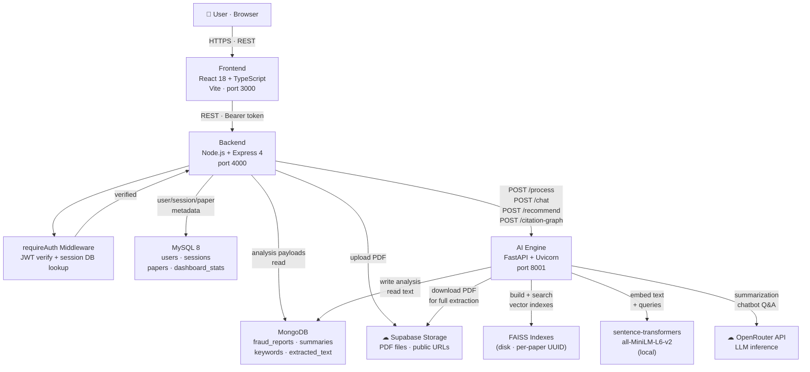

# FraudLens

> AI-powered research paper integrity analysis — fraud detection, plagiarism scoring, citation graph visualization, and RAG-based Q&A in a single platform.

FraudLens solves a real problem faced by researchers, journal editors, and academic institutions: manually reviewing papers for plagiarism, citation manipulation, structural anomalies, and content integrity is slow and error-prone. FraudLens automates the entire pipeline — upload a PDF, get a fraud report, an AI-generated summary, a citation graph, and a chatbot that answers questions about the paper, all in one place.

---

## 1. Problem Statement

### What problem does FraudLens solve?

Academic fraud — including plagiarism, inconsistent citations, suspicious repetition, and fabricated structure — is difficult to catch manually at scale. Existing tools are expensive, narrowly focused on text matching, or require technical expertise to operate.

FraudLens runs a multi-module fraud analysis pipeline automatically on any uploaded PDF, combining rule-based checks with LLM-powered summarization and a RAG chatbot that grounds every answer in the paper's actual content.

### Who would use it?

- **Researchers** validating their own work before submission
- **Journal editors** screening incoming manuscripts
- **Graduate students** checking papers for integrity issues
- **Academic institutions** enforcing research integrity policies

### Why is it useful?

It combines quantitative fraud scores with natural-language explanations in a single workflow. The user uploads one PDF and gets: a plagiarism score, a risk classification, a detailed issue list, an AI-generated structured summary, extracted keywords, an interactive citation graph, semantic paper recommendations, a RAG chatbot, and a downloadable PDF report — all without leaving the dashboard.

---

## 2. Key Features

| Feature | Description |
|---|---|
| **PDF Upload & Cloud Storage** | Upload research papers up to 20 MB; stored in Supabase Storage with a public URL |
| **Fraud Detection Pipeline** | Three concurrent modules: plagiarism scoring, suspicious pattern detection, citation style inconsistency |
| **Risk Classification** | Each paper classified as `low`, `medium`, or `high` risk based on score and issues |
| **AI-Generated Summary** | LLM extracts Title, Main Contributions, Methodology, and Conclusions |
| **Keyword Extraction** | Top 10 content keywords extracted by frequency from full paper text |
| **RAG Chatbot** | Ask questions about any uploaded paper; answers grounded in paper content via FAISS vector search |
| **Citation Graph** | Interactive graph of reference co-citations; detects citation rings (groups of ≥ 3 mutually co-cited references) |
| **Paper Recommender** | Semantic similarity search against a curated academic corpus |
| **PDF Export** | Styled two-page A4 report with fraud metrics, issue list, AI summary, and keywords |
| **Dashboard & Analytics** | Per-user stats: total analyses, high-risk count, cleared papers, average plagiarism |
| **Profile Management** | Update display name and change password |
| **Session-Based Auth** | JWT tokens validated against a server-side session table on every request |
| **Reprocessing** | Retry failed or stuck analyses without re-uploading |
| **Platform Statistics** | Public endpoint showing platform-wide analysis totals and accuracy rate |

---

## 3. Tech Stack

### Frontend
- **React 18** with **TypeScript**
- **Vite 5** — build tool and dev server (port 3000)
- **React Router v6** — client-side routing
- **Recharts** — dashboard data visualizations
- **Axios** — HTTP client for all API calls

### Backend
- **Node.js 22** with **Express 4**
- **multer** — multipart PDF upload handling
- **PDFKit** — server-side PDF report generation
- **Axios** — HTTP client for AI engine proxy calls
- **uuid** — paper UUID generation

### Database
- **MySQL 8** — primary store: users, sessions, paper metadata, dashboard stats
- **MongoDB** — document store: fraud reports, AI summaries, extracted text, keywords

### Authentication
- **jsonwebtoken** — JWT signing and verification
- **bcryptjs** — password hashing (cost factor 12)
- **crypto** (Node built-in) — SHA-256 session token hashing
- Server-side session table in MySQL — tokens invalidatable before expiry

### AI / ML
- **pdfplumber** — PDF text extraction
- **scikit-learn** — TF-IDF vectorization and cosine similarity (plagiarism scoring, recommender)
- **sentence-transformers** (`all-MiniLM-L6-v2`) — local text embeddings for FAISS indexing and chatbot retrieval
- **langchain-text-splitters** — `RecursiveCharacterTextSplitter` for document chunking
- Custom regex + frequency modules — pattern detection, citation style checking, citation graph construction

### LLM
- **OpenRouter API** — unified LLM gateway
- Primary model: `liquid/lfm-2.5-2.6b:free`
- Automatic fallback chain: `nvidia/nemotron-3.5-lightning:free` → `thinkingmachines/inkling-small:free`

### RAG
- **FAISS** (CPU) — vector similarity search, one index per paper stored on disk
- **sentence-transformers** — embedding model for both indexing and query-time retrieval
- Custom RAG pipeline in `chatbot.py` — retrieve → assemble context → prompt LLM

### Vector Database
- **FAISS IndexFlatL2** — per-paper flat L2 index files stored in `ai-engine/faiss_indexes/`

### APIs / External Services
- **Supabase Storage** — cloud storage for uploaded PDF files (free tier)
- **OpenRouter API** — LLM inference (free tier models)

### AI Engine Runtime
- **FastAPI** — Python REST framework for the AI service
- **Uvicorn** — ASGI server
- **motor** — async MongoDB driver (used inside the AI engine)
- **python-dotenv** — environment variable loading

### Other
- **Mongoose 8** — MongoDB ODM for the Node backend
- **mysql2/promise** — MySQL connection pool for Node backend
- **nodemon** — dev-mode auto-restart for the backend

---

## 4. System Architecture



**Architecture philosophy:**
MySQL is the ownership and identity layer — it controls who can access which paper. MongoDB stores large analysis payloads that would be expensive to query relationally. The AI engine is fully decoupled from the Node backend; all compute-heavy work runs in Python. The frontend never talks to the AI engine directly — all requests flow through the Node backend, which acts as an authenticated proxy.

---

## 5. Application Flow

### Registration
1. User submits name, email, and password
2. Backend checks for duplicate email in MySQL
3. Password hashed with bcrypt (cost factor 12)
4. Row inserted into `users` table; `dashboard_stats` row initialised with zeros
5. JWT signed and returned; session row inserted into `sessions` table with a 7-day expiry

### Login
1. User submits email and password
2. Backend fetches user row from MySQL, runs `bcrypt.compare()`
3. On success: JWT signed, new session row created in `sessions`
4. JWT returned to frontend and stored client-side

### Authentication (Every Protected Request)
1. Frontend attaches `Authorization: Bearer <token>` header
2. `requireAuth` middleware verifies the JWT signature
3. Token is SHA-256 hashed and looked up in the `sessions` table — must exist and have `expires_at > NOW()`
4. `req.user` populated from JWT payload; request continues

### Dashboard
- `GET /dashboard/stats` — aggregates totals directly from the `papers` table (not the stats cache)
- `GET /dashboard/recent` — last 5 uploaded papers
- `GET /dashboard/papers` — paginated full paper list
- `GET /stats/platform` — public, no auth; platform-wide totals for the landing page

### Main FraudLens Workflow — PDF Upload & Analysis
1. User selects a PDF (max 20 MB, PDF MIME type enforced)
2. multer stores file temporarily on disk
3. Backend uploads file to Supabase Storage, receives a public URL
4. Temporary local file deleted
5. MySQL paper row inserted with status `processing`
6. `triggerAIEngine()` called **fire-and-forget** — response returned to user immediately
7. Backend responds `{ uuid, status: "processing" }`

### AI / RAG / LLM Processing (background)
1. AI engine downloads the PDF from the Supabase public URL via `requests`
2. pdfplumber extracts full text; raises `UnreadablePDFError` for scanned/image-only PDFs
3. Three modules run **concurrently** via `asyncio.gather`:
   - **Plagiarism:** TF-IDF vectorization of paper text → cosine similarity against reference corpus → score in `[0.0, 1.0]`
   - **Pattern detection:** repeated sentences (≥3 occurrences), overused keywords (>5% word frequency), unusual structure (<3 heading-like lines)
   - **Citation check:** regex detection of mixed citation styles (APA, IEEE, MLA) in a single document
4. FAISS index built in a thread executor: text chunked (512 chars, 50 overlap) → embedded with `all-MiniLM-L6-v2` → `IndexFlatL2` saved to disk
5. LLM generates structured summary (Title, Main Contributions, Methodology, Conclusions); regex fallback activates if LLM fails or returns fewer than 2 filled fields
6. Top 10 keywords extracted by content-word frequency (stopwords excluded)
7. All results written to MongoDB; MySQL paper row updated to `completed` with `risk_level`, `plagiarism_score`, `issue_count`

### Result Generation
- `GET /paper/:uuid` fetches MySQL metadata + MongoDB analysis and merges them in one response
- Frontend renders: plagiarism score bar, risk badge, issue cards, AI summary fields, keyword pills

### RAG Chatbot
1. User types a question about the paper
2. `POST /chat` proxied to AI engine
3. AI engine loads the FAISS index for that paper UUID
4. Question embedded with `all-MiniLM-L6-v2`; top-5 nearest chunks retrieved by L2 search
5. Chunks joined as context; prompt constructed with system instructions to answer only from context
6. LLM response post-processed by `_strip_thinking()` to remove any reasoning preamble
7. Answer and source excerpts returned to frontend

### Citation Graph
1. `GET /citation/:uuid/graph` calls AI engine `POST /citation-graph`
2. AI engine downloads full PDF (avoids the 50 000-char MongoDB truncation)
3. References extracted from bibliography section by numbered and author-year patterns
4. Co-citation edges built from sentences citing multiple references together
5. Citation rings detected: connected components of ≥3 nodes with co-citation weight ≥2
6. Graph data (`nodes`, `edges`, `rings`, `stats`) returned to frontend for visualization

### Logout
1. Frontend sends `POST /auth/logout` with Bearer token
2. Backend computes SHA-256 hash of token, deletes matching session row from MySQL
3. Token is immediately invalid regardless of JWT expiry

---

## 6. Frontend

**Framework:** React 18 with TypeScript, bundled and served by Vite 5

**Dev server:** `http://localhost:3000`

**API communication:**
All API calls go through Axios pointing at `VITE_API_URL` (default `http://localhost:4000`). Vite's dev server also proxies `/api/*` → `http://localhost:4000` with path rewriting, so both direct calls and proxied calls work in development.

**Authentication handling:**
The JWT returned at login is stored client-side. Every Axios request attaches it as `Authorization: Bearer <token>`. The `/auth/me` endpoint is used to rehydrate the user session on page load.

**State management:** Not specified in source code (no Redux, Zustand, or Context API files were present in the inspected file tree).

**Key pages / views** (inferred from API routes and backend structure):
- **Auth pages** — Login, Signup
- **Dashboard** — stats cards (total analyses, high-risk count, cleared, avg plagiarism), recent papers list, paginated full paper table
- **Paper detail** — fraud report (score bar, risk badge, issue list), AI summary, keywords, chatbot panel, citation graph, export button
- **Profile** — update display name, change password

**Charts:** Recharts is listed as a dependency and used for dashboard data visualizations.

---

## 7. Backend

**Framework:** Express 4 running on Node.js 22, port 4000

**Startup sequence:** MySQL connection tested with `SELECT 1` before binding the port; MongoDB connection attempted non-fatally afterward (startup does not fail if MongoDB is temporarily unavailable).

**Database connections:**
- `src/mysql.js` — `mysql2/promise` connection pool, all config from environment variables
- `src/db.js` — Mongoose connection, `MONGO_URI` from environment

**Route structure:**

| Mount Path | File | Responsibility |
|---|---|---|
| `/auth` | `routes/auth.js` | Signup, login, logout, `/me` |
| `/upload` | `routes/upload.js` | PDF upload to Supabase + fire-and-forget AI trigger |
| `/analyze` | `routes/analyze.js` | Poll analysis status; return fraud report when complete |
| `/paper/:uuid` | `routes/paper.js` | Combined MySQL metadata + MongoDB analysis response |
| `/dashboard` | `routes/dashboard.js` | Stats aggregation, recent papers, paginated list |
| `/chat` | `routes/chat.js` | Authenticated proxy → AI engine `/chat` |
| `/recommend` | `routes/recommend.js` | Authenticated proxy → AI engine `/recommend` |
| `/citation` | `routes/citation.js` | Authenticated proxy → AI engine `/citation-graph` |
| `/reprocess/:uuid` | `routes/reprocess.js` | Retry failed/stuck analyses |
| `/export/:uuid/pdf` | `routes/export.js` | Stream styled PDFKit report as file download |
| `/profile` | `routes/profile.js` | Update name/avatar; change password |
| `/stats` | `routes/stats.js` | Public platform-wide statistics |

**Authentication middleware** (`src/middleware/auth.js`):
Verifies JWT signature → SHA-256 hashes the raw token → queries `sessions` table for a matching non-expired row → attaches `req.user` to the request. Every protected route uses this middleware.

**Business logic highlights:**
- Upload is always non-blocking: the paper record is inserted and the response returned before the AI engine finishes
- All paper queries include `WHERE user_id = req.user.id` — strict ownership enforcement
- Supabase client is lazily initialised on first upload attempt so missing credentials produce a clear error rather than crashing the server

**AI engine integration:**
Backend calls `AI_ENGINE_URL` (default `http://localhost:8001`) via Axios. Upload and reprocess use fire-and-forget (`triggerAIEngine` not awaited). Chat, recommend, and citation-graph proxy calls are awaited and their responses forwarded directly.

---

## 8. AI / ML Architecture

The AI engine is a fully independent FastAPI service. The Node backend is its only caller.

| Task | Module | Technique |
|---|---|---|
| PDF text extraction | `pdf_processor.py` | pdfplumber; raises `UnreadablePDFError` for image-only PDFs |
| Plagiarism scoring | `plagiarism.py` | TF-IDF (`TfidfVectorizer`) + cosine similarity vs. built-in reference corpus |
| Pattern detection | `pattern_detector.py` | Sentence splitting + `Counter`; checks repetition, keyword frequency, heading count |
| Citation style check | `citation_checker.py` | Regex for APA, IEEE, MLA; flags mixed styles in one document |
| Citation graph | `citation_checker.py` | Reference extraction + co-citation edge building + DFS ring detection |
| Text embedding | `embedder.py` + `llm.py` | `sentence-transformers all-MiniLM-L6-v2` (local, 384-dim) |
| FAISS index build/search | `embedder.py` | `IndexFlatL2`; one index per paper UUID; dimension-mismatch auto-rebuild |
| Summarization | `summarizer.py` | LLM structured prompt → section parsing; full regex fallback if LLM fails |
| RAG chatbot | `chatbot.py` | FAISS top-5 retrieval → context assembly → LLM generation |
| Recommendations | `recommender.py` | Query + corpus embeddings → cosine similarity → top-10 ranked results |
| PDF download | `downloader.py` | `requests.get()` with streaming write to `tempfile.mkstemp` |

**Input:** Raw PDF file (via Supabase public URL)
**Output:** `{ fraud_report, summary, keywords, extracted_text }` written to MongoDB; MySQL metadata updated

**Why AI is useful here:** Rule-based checks (TF-IDF, regex) are fast and explainable but catch only surface-level patterns. The LLM layer adds natural-language summarization and context-aware Q&A that no rule system can provide. Together they give both a numerical score and a human-readable explanation in the same pipeline.

---

## 9. RAG Pipeline

**Why RAG instead of sending the full paper to the LLM directly?**

Free-tier LLMs have limited context windows and aggressive rate limits. Sending 50 000+ characters per question is impractical. RAG retrieves only the ~1 500 most relevant characters (top-5 chunks × 300 chars each) and sends those — making each call fast, token-efficient, and grounded in the actual paper rather than the model's training data.

### Step-by-step implementation

```
────────────────────────────────────────────────────────
PHASE 1 · INDEXING  (runs once at upload time)
────────────────────────────────────────────────────────

① Input
   Full extracted text from the PDF (pdfplumber output)

② Chunking
   RecursiveCharacterTextSplitter
   chunk_size = 512 characters
   chunk_overlap = 50 characters
   → list of string chunks

③ Embeddings
   sentence-transformers · all-MiniLM-L6-v2 (local)
   → 384-dimensional float32 vectors per chunk

④ Vector index
   faiss.IndexFlatL2(384)
   index.add(chunk_embeddings)
   Saved to disk:
     faiss_indexes/<uuid>.index   ← FAISS binary
     faiss_indexes/<uuid>.chunks  ← pickled chunk list
     faiss_indexes/<uuid>.dim     ← stored dimension

────────────────────────────────────────────────────────
PHASE 2 · RETRIEVAL + GENERATION  (runs per chat query)
────────────────────────────────────────────────────────

⑤ User question
   e.g. "What datasets were used in this study?"

⑥ Query embedding
   Same model: all-MiniLM-L6-v2 → 384-dim vector

⑦ Vector search
   index.search(query_vector, k=5)
   Returns top-5 nearest chunk indices by L2 distance

⑧ Context assembly
   Top-5 chunks (up to 300 chars each) joined with
   "\n\n---\n\n" separators

⑨ Prompt construction
   System: "Answer ONLY based on the provided context.
            Be concise. If insufficient, say so clearly."
   User:   "Context from the paper:\n\n{chunks}
            \n\nQuestion: {question}"

⑩ LLM call
   OpenRouter · liquid/lfm-2.5-2.6b:free
   max_tokens = 600, temperature = 0.2

⑪ Post-processing
   _strip_thinking() removes any <think>...</think> or
   "Here's a thinking process:" preamble blocks

⑫ Response
   { answer: string, sources: [{chunk_id, excerpt}] }
   returned to frontend
```

---

## 10. LLM

**Provider:** [OpenRouter](https://openrouter.ai) — a unified API gateway to multiple LLM providers

**Primary model:** `liquid/lfm-2.5-2.6b:free`

**Automatic fallback chain** (tried in order on HTTP 404 / 429 / 503):
1. `nvidia/nemotron-3.5-lightning:free`
2. `thinkingmachines/inkling-small:free`

**What the LLM receives:**

| Use case | System prompt | User message |
|---|---|---|
| Summarization | Instructions to output exactly four labelled sections (Title, Main Contributions, Methodology, Conclusions) | First 12 000 chars of extracted paper text |
| Chatbot | Instructions to answer only from context; say so if insufficient | Top-5 FAISS chunks + user question |

**What the LLM generates:**
- **Summarization:** Structured plain text with four labelled sections, parsed line-by-line into a JSON object
- **Chatbot:** Direct natural-language answer grounded in retrieved context

**Why an LLM is useful here:**
No rule-based system can produce a coherent three-sentence description of a paper's methodology or answer an open-ended question about its conclusions. The LLM layer bridges the gap between quantitative fraud scores and human-readable explanations.

**Hallucination handling:**
- Chatbot prompt explicitly instructs the model to answer *only* from the provided context excerpts and to state clearly when the context is insufficient
- Summarizer has a complete regex + heuristic fallback (`_text_fallback`) that fires if the LLM call fails or returns fewer than 2 populated fields — the app never returns an empty summary
- `_strip_thinking()` post-processes all LLM output to strip internal reasoning blocks (`<think>...</think>`, `<thinking>...</thinking>`, and `"Here's a thinking process:"` numbered-list preambles emitted by some thinking-mode models)
- On full LLM unavailability, the chatbot returns the most relevant FAISS excerpt with an explanatory message rather than an empty response

---

## 11. Database

### MySQL 8 — Primary store

Handles all user identity, session management, and paper ownership. It is the **authoritative ownership gate** — no paper is served without a matching `user_id` check in MySQL.

| Table | Key columns | Purpose |
|---|---|---|
| `users` | `id`, `name`, `email`, `password` (bcrypt), `role` (researcher/admin), `plan` (free/pro), `avatar` | User accounts |
| `sessions` | `user_id`, `token_hash` (SHA-256), `expires_at` | Server-side JWT session store |
| `papers` | `uuid`, `user_id`, `filename`, `file_path`, `status`, `risk_level`, `plagiarism_score`, `issue_count`, `uploaded_at`, `expires_at`, `completed_at` | Paper metadata and analysis status |
| `dashboard_stats` | `user_id`, `total_analyses`, `high_risk_count`, `cleared_count`, `avg_plagiarism` | Per-user stats seed row (live stats aggregated directly from `papers`) |

**Relationships:**
- `sessions.user_id` → `users.id` ON DELETE CASCADE
- `papers.user_id` → `users.id` ON DELETE CASCADE
- `dashboard_stats.user_id` → `users.id` ON DELETE CASCADE (UNIQUE)

### MongoDB — Document store

Stores large analysis payloads that are impractical to hold in MySQL columns.

**Collection: `papers`**

| Field | Type | Purpose |
|---|---|---|
| `uuid` | String (unique index) | Foreign key to MySQL `papers.uuid` |
| `filename` | String | Original uploaded filename |
| `file_path` | String | Supabase public URL |
| `status` | Enum | `processing` / `completed` / `failed` |
| `extracted_text` | String | First 50 000 chars of PDF text |
| `fraud_report` | Object | `{ plagiarism_score, risk_level, issues[] }` |
| `summary` | Object | `{ title, main_contributions, methodology, conclusions }` |
| `keywords` | String[] | Top 10 content keywords |
| `expires_at` | Date | 24 hours after upload |

**Data flow:**
1. AI engine writes to MongoDB after processing completes
2. Node backend reads from MongoDB to serve `GET /paper/:uuid`, `GET /export/:uuid/pdf`, and reprocess endpoints
3. MySQL is always checked first for ownership before MongoDB data is returned

### FAISS (disk)

Per-paper vector indexes stored in `ai-engine/faiss_indexes/`:
- `<uuid>.index` — FAISS binary index file
- `<uuid>.chunks` — pickled Python list of text chunks
- `<uuid>.dim` — stored embedding dimension (used for dimension-mismatch detection)

---

## 12. Authentication & Security

### Registration
- Required fields: `name`, `email`, `password` (min 8 characters)
- Duplicate email checked in MySQL before insert
- Password hashed with `bcrypt.hash(password, 12)` — cost factor 12

### Password handling
- Stored only as bcrypt hash, never plaintext
- Comparison always via `bcrypt.compare()` (constant-time)
- Password change requires providing the current password first

### Login
- `bcrypt.compare()` against stored hash
- JWT signed with `JWT_SECRET` (from environment), expiry from `JWT_EXPIRES_IN` (default `7d`)
- Session row inserted: `token_hash = SHA256(raw_token)`, `expires_at = NOW() + 7 days`

### Token validation (every protected request)
```
Authorization: Bearer <token>
        ↓
jwt.verify(token, JWT_SECRET)  ← signature + expiry check
        ↓
SHA-256(token) → query sessions table
  WHERE token_hash = ? AND expires_at > NOW() AND user_id = payload.id
        ↓
rows.length === 0  →  401 Session expired or invalid
rows.length > 0   →  req.user = payload  →  next()
```

### Authorization
- Every paper query includes `WHERE user_id = req.user.id` — users can only access their own papers
- No cross-user data leakage is possible through any documented route

### Protected routes
All routes except `/auth/signup`, `/auth/login`, `/stats/platform`, and `/health` require a valid session.

### Logout
`DELETE FROM sessions WHERE token_hash = SHA256(token)` — the token is immediately invalid regardless of its JWT expiry time.

### Security considerations
- Passwords never stored or logged in plaintext
- JWT raw values never stored in the database — only their SHA-256 hash
- multer enforces PDF MIME type (`application/pdf`) and 20 MB size limit; non-PDF uploads rejected with HTTP 400
- Supabase client lazily initialised — missing credentials produce a descriptive error at upload time, not a server crash at startup
- CORS currently set to `origin: '*'` — appropriate for local development; **must be restricted to the frontend domain before any public deployment**

---

## 13. API Documentation

### Authentication

| Method | Endpoint | Auth | Purpose | Request / Response |
|---|---|---|---|---|
| POST | `/auth/signup` | ❌ | Register a new user | Body: `{name, email, password}` → `{token, user}` |
| POST | `/auth/login` | ❌ | Login | Body: `{email, password}` → `{token, user}` |
| POST | `/auth/logout` | ✅ | Invalidate session | Bearer token → `{message}` |
| GET | `/auth/me` | ✅ | Get current user | Bearer token → `{user}` |

### Upload & Analysis

| Method | Endpoint | Auth | Purpose | Request / Response |
|---|---|---|---|---|
| POST | `/upload` | ✅ | Upload PDF | `multipart/form-data` field `file` → `{uuid, status}` |
| POST | `/analyze` | ✅ | Poll analysis status | Body: `{uuid}` → `{uuid, fraud_report, summary}` or `{status: "processing"}` |
| GET | `/paper/:uuid` | ✅ | Full paper data | — → merged MySQL metadata + MongoDB analysis |
| POST | `/reprocess/:uuid` | ✅ | Retry failed analysis | — → `{uuid, status: "processing"}` |

### Dashboard

| Method | Endpoint | Auth | Purpose | Request / Response |
|---|---|---|---|---|
| GET | `/dashboard/stats` | ✅ | Aggregated user stats | — → `{total_analyses, high_risk_count, cleared_count, avg_plagiarism}` |
| GET | `/dashboard/recent` | ✅ | Last 5 papers | — → `{papers[]}` |
| GET | `/dashboard/papers` | ✅ | Paginated paper list | `?page=1&limit=20` → `{papers[], total, page, limit}` |
| GET | `/stats/platform` | ❌ | Platform-wide public stats | — → `{total_papers, avg_analysis_secs, accuracy_rate, avg_plagiarism}` |

### AI Features

| Method | Endpoint | Auth | Purpose | Request / Response |
|---|---|---|---|---|
| POST | `/chat` | ✅ | RAG chatbot | Body: `{uuid, question}` → `{answer, sources[]}` |
| POST | `/recommend` | ✅ | Semantic paper recommendations | Body: `{query}` → `{results[]}` |
| GET | `/citation/:uuid/graph` | ✅ | Citation graph | — → `{uuid, graph: {nodes, edges, rings, stats}}` |

### Profile & Export

| Method | Endpoint | Auth | Purpose | Request / Response |
|---|---|---|---|---|
| PUT | `/profile` | ✅ | Update display name | Body: `{name}` → `{name, avatar}` |
| PUT | `/profile/password` | ✅ | Change password | Body: `{current_password, new_password}` → `{message}` |
| GET | `/export/:uuid/pdf` | ✅ | Download PDF report | — → `application/pdf` file stream |

### Health

| Method | Endpoint | Auth | Purpose |
|---|---|---|---|
| GET | `/health` | ❌ | Backend liveness check → `{status: "ok", time}` |

---

## 14. Project Structure

```
fraudlens/
│
├── .env                        ← Root: OPENROUTER_API_KEY
├── .env.example
├── .gitignore                  ← Covers .env in all subdirectories
├── GITHUB_README.md            ← This file
│
├── frontend/                   ── React + TypeScript (Vite)
│   ├── src/
│   │   ├── components/         ← Reusable UI components
│   │   └── pages/              ← Route-level page components
│   ├── .env                    ← VITE_API_URL=http://localhost:4000
│   ├── .env.example
│   ├── vite.config.ts          ← Dev server port 3000; /api proxy → :4000
│   └── package.json
│
├── backend/                    ── Node.js + Express
│   ├── src/
│   │   ├── index.js            ← App entry: route registration, startup checks
│   │   ├── mysql.js            ← mysql2/promise connection pool
│   │   ├── db.js               ← Mongoose connection
│   │   ├── middleware/
│   │   │   └── auth.js         ← requireAuth: JWT verify + session DB check
│   │   ├── models/
│   │   │   └── Paper.js        ← Mongoose schema for analysis documents
│   │   └── routes/
│   │       ├── auth.js         ← /auth
│   │       ├── upload.js       ← /upload  (Supabase + AI engine trigger)
│   │       ├── analyze.js      ← /analyze
│   │       ├── paper.js        ← /paper/:uuid
│   │       ├── dashboard.js    ← /dashboard
│   │       ├── chat.js         ← /chat  (proxy → AI engine)
│   │       ├── recommend.js    ← /recommend  (proxy → AI engine)
│   │       ├── citation.js     ← /citation  (proxy → AI engine)
│   │       ├── reprocess.js    ← /reprocess
│   │       ├── export.js       ← /export  (PDFKit report generation)
│   │       ├── profile.js      ← /profile
│   │       └── stats.js        ← /stats/platform
│   ├── scripts/
│   │   └── init-mysql.js       ← One-time MySQL schema creation
│   ├── .env                    ← All backend secrets and DB credentials
│   ├── .env.example
│   └── package.json
│
└── ai-engine/                  ── Python FastAPI service
    ├── main.py                 ← FastAPI app + all route handlers
    ├── modules/
    │   ├── pdf_processor.py    ← pdfplumber text extraction
    │   ├── fraud_detector.py   ← Orchestrator: runs 3 modules via asyncio.gather
    │   ├── plagiarism.py       ← TF-IDF + cosine similarity scoring
    │   ├── pattern_detector.py ← Regex + frequency pattern detection
    │   ├── citation_checker.py ← Citation style check + graph builder + ring detector
    │   ├── embedder.py         ← FAISS index build, save, load, search
    │   ├── chatbot.py          ← RAG pipeline: retrieve → prompt → LLM
    │   ├── summarizer.py       ← LLM summarization + full regex fallback
    │   ├── recommender.py      ← Embedding cosine similarity recommender
    │   ├── llm.py              ← OpenRouter client + fallback chain + _strip_thinking
    │   └── downloader.py       ← PDF download from Supabase URL to tempfile
    ├── faiss_indexes/          ← Per-paper FAISS indexes (gitignored)
    ├── .env                    ← MONGO_URI, OPENROUTER_API_KEY, FAISS_STORE_PATH, MODEL
    ├── .env.example
    └── requirements.txt
```

---

## 15. Installation & Setup

### Prerequisites

| Requirement | Version |
|---|---|
| Node.js | 18 or later |
| npm | bundled with Node.js |
| Python | 3.11 |
| MySQL | 8.0 running locally |
| MongoDB | 6.0+ running locally (or Atlas URI) |
| Supabase account | Free tier — [supabase.com](https://supabase.com) |
| OpenRouter account | Free tier — [openrouter.ai](https://openrouter.ai) |

### Step 1 — Clone

```bash
git clone <your-repo-url>
cd fraudlens
```

### Step 2 — Supabase setup

1. Create a free project at [supabase.com](https://supabase.com)
2. Go to **Storage → New bucket**, name it `papers`, tick **Public bucket**
3. Go to **Project Settings → API**
4. Copy the **Project URL** and the **`service_role`** secret key (starts with `eyJ`)

### Step 3 — Backend environment

```bash
cp backend/.env.example backend/.env
```

Fill in `backend/.env`:

```env
PORT=4000

MYSQL_HOST=localhost
MYSQL_PORT=3306
MYSQL_USER=root
MYSQL_PASSWORD=your_mysql_root_password
MYSQL_DB=fraudlens

MONGO_URI=mongodb://localhost:27017/fraudlens

AI_ENGINE_URL=http://localhost:8001

JWT_SECRET=replace_with_a_long_random_string
JWT_EXPIRES_IN=7d

SUPABASE_URL=https://your-project-ref.supabase.co
SUPABASE_SERVICE_ROLE_KEY=eyJ...your_service_role_key
SUPABASE_BUCKET=papers
```

Generate a strong JWT secret:

```bash
node -e "console.log(require('crypto').randomBytes(32).toString('hex'))"
```

### Step 4 — MySQL schema

Start your local MySQL service, then:

```bash
cd backend
node scripts/init-mysql.js
```

This creates the `users`, `sessions`, `papers`, and `dashboard_stats` tables.

### Step 5 — Backend dependencies

```bash
cd backend
npm install
```

### Step 6 — AI Engine environment

```bash
cp ai-engine/.env.example ai-engine/.env
```

Fill in `ai-engine/.env`:

```env
MONGO_URI=mongodb://localhost:27017/fraudlens
OPENROUTER_API_KEY=sk-or-v1-your_key_here
FAISS_STORE_PATH=./faiss_indexes
OPENROUTER_MODEL=liquid/lfm-2.5-2.6b:free
```

### Step 7 — AI Engine dependencies

```bash
cd ai-engine
pip install -r requirements.txt
```

### Step 8 — Frontend environment

```bash
cp frontend/.env.example frontend/.env
# Default value is already correct:
# VITE_API_URL=http://localhost:4000
```

```bash
cd frontend
npm install
```

### Step 9 — Start all services

Open **three separate terminals**:

**Terminal 1 — Backend**
```bash
cd backend
npm run dev
```
✅ `MySQL connected` → `Backend listening on port 4000`

**Terminal 2 — AI Engine**
```bash
cd ai-engine
uvicorn main:app --host 0.0.0.0 --port 8001
```
✅ `Application startup complete` → `Uvicorn running on http://0.0.0.0:8001`

**Terminal 3 — Frontend**
```bash
cd frontend
npm run dev
```
✅ `VITE ready` → `Local: http://localhost:3000/`

Open **http://localhost:3000** in your browser.

---

## 16. Example Workflow

**Scenario:** A PhD student wants to verify their paper before final submission.

1. **Sign up** at `http://localhost:3000` — enters name, email, and a password (min 8 chars)
2. **Log in** — lands on the dashboard with empty stats (0 analyses, all zeros)
3. **Upload** — clicks Upload, selects `research_paper.pdf` (5 MB)
4. **Processing** — the paper appears in the dashboard with status `processing`; in the background, the AI engine downloads the PDF from Supabase, extracts text, runs three fraud checks concurrently, builds the FAISS vector index, and asks the LLM for a structured summary
5. **Results** (30–90 seconds later) — status changes to `completed`; the student opens the paper detail:
   - **Fraud Report:** Plagiarism score 19%, risk level `low`, 1 issue — `citation_inconsistency` (mixed APA and IEEE styles detected)
   - **AI Summary:** Paper title extracted; Main Contributions, Methodology, and Conclusions each summarised in 3–5 sentences
   - **Keywords:** top 10 content terms displayed as pill badges
6. **Chatbot** — types _"What datasets were used in this study?"_; the RAG pipeline retrieves the top 5 methodology-section chunks and the LLM answers directly from the paper text
7. **Citation Graph** — opens the graph view; sees 31 reference nodes, 12 co-citation edges, 0 rings detected
8. **Recommendations** — types _"transformer NLP classification"_; receives top-10 semantically similar papers from the built-in corpus, ranked by cosine similarity
9. **Export** — clicks Download Report; receives a styled two-page A4 PDF with the fraud metrics, issue cards, and AI summary — ready to share with a supervisor
10. **Logout** — session deleted server-side; token immediately invalidated

---

## 17. Future Improvements

| Area | Improvement |
|---|---|
| **Plagiarism corpus** | Current TF-IDF scoring uses a small built-in corpus; integrating a live academic API (CrossRef, Semantic Scholar) would produce meaningful real-world scores |
| **Recommendation corpus** | The recommender uses 12 hardcoded papers; connecting to an academic search API would make it genuinely useful at scale |
| **Paper expiry** | `expires_at` fields exist in MySQL and MongoDB but no background job cleans up expired papers or their FAISS indexes |
| **Real-time status** | The frontend must poll for analysis completion; WebSocket or Server-Sent Events would give live progress updates |
| **CORS hardening** | CORS is `origin: '*'` — must be restricted to the frontend domain before public deployment |
| **Rate limiting** | No rate limiting exists on any route; essential before public exposure |
| **Admin routes** | The `role` field (`researcher` / `admin`) exists in the `users` table but no admin-only routes are implemented |
| **MongoDB TTL index** | A TTL index on `papers.expires_at` would auto-purge expired documents without a separate job |
| **Vector store** | On-disk FAISS files don't scale horizontally; replacing with a vector database (Qdrant, Weaviate) would enable multi-instance deployments |
| **Multi-column PDF handling** | pdfplumber extraction on two-column academic PDFs can produce merged lines that confuse the summarizer's section detector |
| **Scanned PDF handling** | `UnreadablePDFError` is raised for image-only PDFs; an OCR step (e.g. pytesseract) would extend coverage |

---

## 18. Conclusion

FraudLens is a production-structured, full-stack AI application that brings together React, Node.js/Express, Python/FastAPI, MySQL, MongoDB, FAISS, and an LLM via OpenRouter into a coherent research integrity analysis platform. Its architecture deliberately separates concerns: MySQL owns identity and access control, MongoDB stores large analysis payloads, and the AI engine handles all compute-heavy Python workloads independently. The RAG chatbot grounds every answer in the actual uploaded paper, eliminating LLM hallucinations on paper-specific questions. The fraud detection pipeline runs three modules concurrently and produces both a numeric score and human-readable issue descriptions — giving researchers actionable, explainable results from a single PDF upload. The codebase is designed for local self-hosting with a clear path to production hardening.
