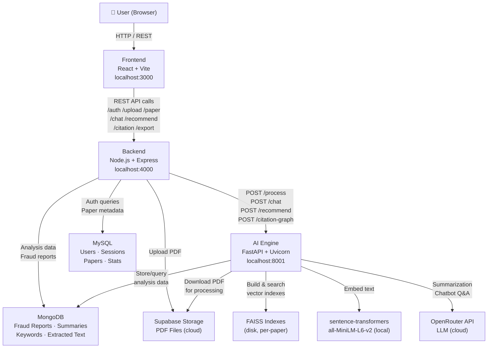

# FraudLens

> AI-powered research paper integrity analysis — fraud detection, plagiarism scoring, citation graph visualization, and RAG-based Q&A in a single platform.

---

## Overview

Academic fraud — plagiarism, citation manipulation, structural anomalies, and fabricated content — is difficult to detect manually at scale. FraudLens automates this process: a researcher uploads a PDF, and the platform runs a multi-module fraud analysis pipeline, generates an AI summary, builds an interactive citation graph, and lets the user interrogate the paper through a context-aware chatbot. All results are exportable as a styled PDF report.

---

## 1. Problem Statement

**What problem does FraudLens solve?**

Manually reviewing research papers for plagiarism, inconsistent citations, suspicious structural patterns, and content integrity is time-consuming and error-prone. Existing tools are either expensive, limited to simple text matching, or lack AI-assisted analysis.

**Who uses it?**

- Academic researchers validating papers before submission or review
- Journal editors screening submissions for integrity issues
- Graduate students checking their own work
- Institutions enforcing academic integrity policies

**Why is it useful?**

FraudLens combines rule-based detection (pattern matching, citation style checks, TF-IDF similarity) with LLM-powered summarization and a RAG chatbot — giving users both quantitative scores and natural-language explanations from a single upload.

---

## 2. Key Features

- **PDF Upload & Cloud Storage** — Upload research papers (up to 20 MB); stored in Supabase Storage with a public URL
- **Fraud Detection Pipeline** — Three concurrent modules: plagiarism scoring, suspicious pattern detection, and citation style inconsistency checking
- **Risk Classification** — Each paper is assigned a risk level: `low`, `medium`, or `high`
- **AI-Generated Summary** — LLM extracts Title, Main Contributions, Methodology, and Conclusions from the paper
- **Keyword Extraction** — Top 10 content keywords extracted from the full paper text
- **RAG Chatbot** — Ask questions about any uploaded paper; answers are grounded in the paper's actual content via FAISS vector search
- **Citation Graph** — Interactive visualization of reference co-citation relationships and detected citation rings
- **Paper Recommender** — Semantic similarity search against a curated corpus of academic papers
- **PDF Export** — Styled two-page A4 report with fraud metrics, issue list, AI summary, and keywords
- **Dashboard** — Per-user analytics: total analyses, high-risk count, cleared papers, average plagiarism score
- **Profile Management** — Update display name and change password
- **Session-based Auth** — JWT tokens validated against a server-side session table on every request

---

## 3. Tech Stack

| Layer | Technology |
|---|---|
| **Frontend** | React 18, TypeScript, Vite 5, React Router v6, Recharts, Axios |
| **Backend** | Node.js, Express 4 |
| **Primary Database** | MySQL 8 (users, sessions, papers metadata, dashboard stats) |
| **Document Store** | MongoDB (full analysis data: fraud reports, summaries, embeddings, extracted text) |
| **Authentication** | JWT (`jsonwebtoken`), bcryptjs, server-side session table in MySQL |
| **AI Engine** | Python 3.11, FastAPI, Uvicorn |
| **Embeddings** | `sentence-transformers` — `all-MiniLM-L6-v2` (local, no API call) |
| **Vector Database** | FAISS (CPU) — one index file per paper, stored on disk |
| **LLM** | OpenRouter API — `liquid/lfm-2.5-2.6b:free` (primary) with automatic fallback chain |
| **PDF Parsing** | pdfplumber |
| **PDF Generation** | PDFKit (Node.js) |
| **Cloud Storage** | Supabase Storage (PDF files) |
| **ML / NLP** | scikit-learn (TF-IDF, cosine similarity), langchain-text-splitters |
| **HTTP Client** | Axios (Node.js backend → AI engine), `requests` (Python downloader) |
| **ORM / ODM** | mysql2/promise (raw pooled queries), Mongoose 8 |

---

## 4. System Architecture



**Key design decision:** MySQL is the primary source of truth for ownership and metadata. MongoDB stores the large analysis payloads (fraud reports, summaries, full extracted text). The AI engine writes directly to MongoDB after processing; the Node backend reads from both databases to compose API responses.

---

## 5. Application Flow

### Registration
1. User submits name, email, and password via the signup form
2. Backend checks for duplicate email in MySQL
3. Password is hashed with bcrypt (cost factor 12)
4. User row inserted into `users` table; `dashboard_stats` row initialised
5. JWT signed and returned; session row inserted into `sessions` table

### Login
1. User submits email and password
2. Backend fetches user from MySQL, compares password with bcrypt
3. JWT signed and returned; new session row created in `sessions`
4. Token stored client-side (browser storage)

### Authentication on Every Request
1. Frontend sends `Authorization: Bearer <token>` header
2. `requireAuth` middleware verifies JWT signature
3. SHA-256 hash of token is looked up in `sessions` table — must exist and not be expired
4. `req.user` populated with JWT payload; request proceeds

### Dashboard
- `GET /dashboard/stats` — aggregates total analyses, high-risk count, cleared count, average plagiarism from MySQL
- `GET /dashboard/recent` — last 5 papers for the user
- `GET /dashboard/papers` — paginated full paper list (up to 50 per page)
- `GET /stats/platform` — public endpoint; platform-wide totals shown on the login page

### PDF Upload & Analysis
1. User selects a PDF file (max 20 MB)
2. Backend receives file via multer (temporary disk storage)
3. File uploaded to Supabase Storage; public URL returned
4. Paper row inserted into MySQL with status `processing`
5. `triggerAIEngine()` called fire-and-forget (response returned immediately to user)
6. AI engine downloads PDF from Supabase, extracts text with pdfplumber
7. Three analysis modules run concurrently (asyncio.gather):
   - Plagiarism score (TF-IDF cosine similarity)
   - Pattern detection (repeated sentences, overused keywords, unusual structure)
   - Citation style check (mixed APA/IEEE/MLA detection)
8. FAISS index built from chunked text using sentence-transformers embeddings
9. LLM generates structured summary (Title, Contributions, Methodology, Conclusions)
10. Top 10 keywords extracted by word frequency
11. Results written to MongoDB; MySQL paper row updated to `completed`

### Fraud Analysis Results
- `GET /paper/:uuid` — fetches MySQL metadata + MongoDB analysis data in one response
- Frontend displays plagiarism score, risk level, issue list, AI summary, and keywords

### RAG Chatbot
1. User types a question about the paper
2. Backend proxies request to AI engine `POST /chat`
3. AI engine embeds the question with sentence-transformers
4. FAISS similarity search returns top-5 most relevant chunks from the paper
5. Chunks assembled into a context block; prompt constructed with system instructions
6. LLM generates an answer grounded in the retrieved context
7. Answer and source excerpts returned to the frontend

### Citation Graph
1. User opens the citation graph view
2. Backend calls AI engine `POST /citation-graph` with the paper's Supabase URL
3. AI engine downloads full PDF, extracts complete text (avoids the 50 000-char MongoDB truncation)
4. References extracted from the bibliography section
5. Co-citation edges built from sentences that cite multiple references together
6. Citation rings detected (connected components of size ≥ 3 with repeated co-citation weight)
7. Graph data returned; frontend renders nodes, edges, and rings

### Paper Recommendations
1. User submits a search query (min 3 characters)
2. Backend proxies to AI engine `POST /recommend`
3. Query and all corpus abstracts embedded with sentence-transformers
4. Cosine similarity computed; top-10 results ranked and returned

### PDF Export
- `GET /export/:uuid/pdf` — generates a styled two-page A4 PDF report using PDFKit
- Page 1: fraud metrics (plagiarism score bar, risk level, issue list)
- Page 2: AI summary sections, extracted keywords, disclaimer
- Delivered as a file download attachment

### Logout
1. Frontend sends `POST /auth/logout` with Bearer token
2. Backend deletes the session row from MySQL by token hash
3. Token is now invalid even if not yet expired

---

## 6. Frontend

**Framework:** React 18 with TypeScript, built and served by Vite 5

**Dev server port:** `3000`

**API communication:** All requests go through Axios to `VITE_API_URL` (default `http://localhost:4000`). Vite also proxies `/api` → `http://localhost:4000` in development.

**Authentication:** JWT stored client-side; attached as `Authorization: Bearer <token>` on all protected requests.

**Key pages / components (inferred from routes):**
- Auth pages — Login, Signup
- Dashboard — stats cards, recent papers list, paginated paper table
- Paper detail — fraud report, AI summary, keywords, chatbot, citation graph
- Export — trigger PDF download
- Profile — update name, change password

**Charts:** Recharts library used for data visualizations on the dashboard.

---

## 7. Backend

**Framework:** Express 4, Node.js 22

**Port:** `4000`

**Database connections:**
- MySQL via `mysql2/promise` connection pool (`src/mysql.js`)
- MongoDB via Mongoose (`src/db.js`) — non-fatal if unavailable at startup

**Route structure:**

| Prefix | File | Responsibility |
|---|---|---|
| `/auth` | `routes/auth.js` | Signup, login, logout, `/me` |
| `/upload` | `routes/upload.js` | PDF upload, Supabase storage, trigger AI engine |
| `/analyze` | `routes/analyze.js` | Poll analysis status, return fraud report |
| `/paper` | `routes/paper.js` | Fetch combined MySQL + MongoDB paper data |
| `/dashboard` | `routes/dashboard.js` | Stats, recent papers, paginated list |
| `/chat` | `routes/chat.js` | Proxy chatbot requests to AI engine |
| `/recommend` | `routes/recommend.js` | Proxy recommendation requests to AI engine |
| `/citation` | `routes/citation.js` | Proxy citation graph requests to AI engine |
| `/reprocess` | `routes/reprocess.js` | Retry failed analyses |
| `/export` | `routes/export.js` | Generate and stream PDF report |
| `/profile` | `routes/profile.js` | Update name/avatar, change password |
| `/stats` | `routes/stats.js` | Public platform-wide statistics |

**Authentication middleware** (`src/middleware/auth.js`): Verifies JWT signature, then validates the token hash exists in the MySQL `sessions` table and has not expired. Attaches `req.user` to the request.

**AI engine integration:** Backend calls `AI_ENGINE_URL` (default `http://localhost:8001`) via Axios. Upload and reprocess calls are fire-and-forget (non-blocking). Chat, recommend, and citation-graph calls await the response and proxy it directly.

---

## 8. AI / ML Architecture

The AI engine is a standalone FastAPI service (Python) that runs all ML/AI workloads separately from the Node backend.

**What AI is used for:**

| Task | Module | Method |
|---|---|---|
| Text extraction | `pdf_processor.py` | pdfplumber |
| Plagiarism scoring | `plagiarism.py` | TF-IDF vectorization + cosine similarity vs. reference corpus |
| Pattern detection | `pattern_detector.py` | Regex + frequency analysis (repeated sentences, overused keywords, structure) |
| Citation checking | `citation_checker.py` | Regex detection of mixed citation styles (APA, IEEE, MLA) |
| Embeddings | `embedder.py` + `llm.py` | sentence-transformers `all-MiniLM-L6-v2` (local) |
| Vector indexing | `embedder.py` | FAISS IndexFlatL2, one index per paper UUID |
| Summarization | `summarizer.py` | LLM (OpenRouter) with structured prompt; regex fallback if LLM fails |
| Chatbot Q&A | `chatbot.py` | RAG: FAISS retrieval + LLM generation |
| Recommendations | `recommender.py` | sentence-transformers embeddings + cosine similarity vs. fixed corpus |
| Citation graph | `citation_checker.py` | Reference extraction + co-citation edge building + ring detection |

**Why is AI useful here?**

Rule-based checks (TF-IDF, regex) are fast and explainable but limited. The LLM layer adds natural-language summarization and context-aware Q&A that rules cannot provide. Together they give both a quantitative score and a human-readable explanation.

---

## 9. RAG Pipeline

RAG (Retrieval-Augmented Generation) is used for the chatbot so that the LLM answers questions about a *specific uploaded paper* rather than hallucinating from its training data.

**Why RAG instead of sending the full paper to the LLM?**

Free-tier LLMs have small context windows and high rate limits. Sending 50 000+ characters per question is impractical. RAG retrieves only the 5 most relevant passages (~1 500 characters) and sends those, making each call fast, cheap, and grounded.

**Step-by-step pipeline:**

```
1. INDEXING (at upload time)
   ─────────────────────────────────────────────────────
   PDF text (full document)
       │
       ▼
   RecursiveCharacterTextSplitter
   chunk_size=512, chunk_overlap=50
       │
       ▼
   sentence-transformers all-MiniLM-L6-v2
   → 384-dimensional float32 embeddings
       │
       ▼
   FAISS IndexFlatL2
   Saved to disk: faiss_indexes/<uuid>.index
                  faiss_indexes/<uuid>.chunks  (pickle)
                  faiss_indexes/<uuid>.dim

2. RETRIEVAL (at query time)
   ─────────────────────────────────────────────────────
   User question (string)
       │
       ▼
   sentence-transformers all-MiniLM-L6-v2
   → query embedding (384-dim)
       │
       ▼
   FAISS L2 search → top-5 nearest chunk indices
       │
       ▼
   Retrieved chunks (up to 300 chars each)

3. GENERATION
   ─────────────────────────────────────────────────────
   System prompt:
     "Answer ONLY based on the provided context..."
       +
   User message:
     "Context from the paper:\n\n{chunks}\n\nQuestion: {question}"
       │
       ▼
   OpenRouter LLM (liquid/lfm-2.5-2.6b:free)
       │
       ▼
   Answer text + source excerpts returned to frontend
```

**Dimension mismatch guard:** If the query embedding dimension differs from the stored index dimension (e.g. after switching embedding models), the index is automatically rebuilt before searching.

---

## 10. LLM

**Provider:** [OpenRouter](https://openrouter.ai) — a unified API gateway to multiple models

**Primary model:** `liquid/lfm-2.5-2.6b:free`

**Fallback chain** (tried in order on 404/429/503):
1. `nvidia/nemotron-3.5-lightning:free`
2. `thinkingmachines/inkling-small:free`

**What the LLM receives:**
- For summarization: first 12 000 characters of extracted paper text + structured system prompt requesting four specific sections
- For chatbot: top-5 FAISS-retrieved context chunks + user question

**What the LLM generates:**
- Summarization: Title, Main Contributions, Methodology, Conclusions (structured plain text)
- Chatbot: direct answer grounded in retrieved context

**Hallucination handling:**
- Chatbot system prompt instructs the model to answer *only* from the provided context and say so clearly if the context is insufficient
- Summarizer has a full text-extraction fallback (regex + heuristics) that activates if the LLM call fails or returns fewer than 2 filled fields
- `_strip_thinking()` post-processes all LLM responses to remove internal reasoning blocks (`<think>` tags, "Here's a thinking process:" preambles) that some models emit before their actual answer

---

## 11. Database

### MySQL — Primary store (user-facing data)

| Table | Key Columns | Purpose |
|---|---|---|
| `users` | id, name, email, password (bcrypt), role, plan, avatar | User accounts |
| `sessions` | user_id, token_hash (SHA-256), expires_at | Server-side JWT validation |
| `papers` | uuid, user_id, filename, file_path, status, risk_level, plagiarism_score, issue_count, uploaded_at, expires_at, completed_at | Paper metadata and analysis status |
| `dashboard_stats` | user_id, total_analyses, high_risk_count, cleared_count, avg_plagiarism | Per-user stats cache (kept as a seed row; actual stats aggregated live from `papers`) |

**Relationships:** `sessions.user_id` → `users.id`, `papers.user_id` → `users.id`, `dashboard_stats.user_id` → `users.id` (all with `ON DELETE CASCADE`)

### MongoDB — Document store (analysis payloads)

**Collection: `papers`**

| Field | Type | Purpose |
|---|---|---|
| `uuid` | String (unique) | Links to MySQL `papers.uuid` |
| `filename` | String | Original filename |
| `file_path` | String | Supabase public URL |
| `status` | Enum | processing / completed / failed |
| `extracted_text` | String | First 50 000 chars of PDF text |
| `fraud_report` | Object | `{plagiarism_score, risk_level, issues[]}` |
| `summary` | Object | `{title, main_contributions, methodology, conclusions}` |
| `keywords` | String[] | Top 10 content keywords |
| `expires_at` | Date | TTL field (24 hours after upload) |

**Data flow:** AI engine writes to MongoDB after processing. Node backend reads from MongoDB to serve paper detail, export, and reprocess endpoints. MySQL is always the ownership gate — a paper is only served if `user_id` matches in MySQL.

### FAISS (disk)

One index per paper UUID. Files stored in `ai-engine/faiss_indexes/`:
- `<uuid>.index` — FAISS binary index
- `<uuid>.chunks` — pickled list of text chunks
- `<uuid>.dim` — stored embedding dimension

---

## 12. Authentication & Security

**Registration:**
- Input validation: name, email, password (min 8 chars) required
- Duplicate email check in MySQL before insert
- Password hashed with bcrypt, cost factor 12

**Login:**
- `bcrypt.compare()` used for password verification (constant-time)
- On success: JWT signed with `JWT_SECRET` (default expiry 7 days)
- Session row inserted: `token_hash = SHA-256(token)`, with `expires_at`

**Token validation (every protected request):**
- `requireAuth` middleware: verify JWT signature → hash token → query `sessions` table
- Session must exist AND `expires_at > NOW()` AND `user_id` must match JWT payload
- This means tokens can be invalidated server-side (logout deletes the session row)

**Logout:**
- `DELETE FROM sessions WHERE token_hash = ?` — token immediately invalid

**Authorization:**
- All paper operations filter by `user_id = req.user.id` — users can only access their own papers
- `/stats/platform` is the only unauthenticated endpoint

**Security considerations:**
- Passwords never stored in plaintext
- JWTs never stored in database — only their SHA-256 hash
- Multer enforces PDF-only uploads (MIME type check) and 20 MB size limit
- Supabase credentials validated at first use (not at server startup) — missing credentials fail gracefully with a clear error message rather than crashing the process
- CORS configured for all origins (`*`) — suitable for local development; should be restricted in production

---

## 13. API Documentation

All protected endpoints require `Authorization: Bearer <token>` header.

### Auth

| Method | Endpoint | Auth | Purpose |
|---|---|---|---|
| POST | `/auth/signup` | ❌ | Register new user; returns JWT + user |
| POST | `/auth/login` | ❌ | Login; returns JWT + user |
| POST | `/auth/logout` | ✅ | Invalidate session |
| GET | `/auth/me` | ✅ | Return current user from token |

### Upload & Analysis

| Method | Endpoint | Auth | Purpose |
|---|---|---|---|
| POST | `/upload` | ✅ | Upload PDF (`multipart/form-data`, field `file`); returns `{uuid, status}` |
| POST | `/analyze` | ✅ | Body `{uuid}` — poll analysis status; returns fraud report when complete |
| GET | `/paper/:uuid` | ✅ | Full paper data (MySQL metadata + MongoDB analysis) |
| POST | `/reprocess/:uuid` | ✅ | Retry a failed or stuck paper |

### Dashboard

| Method | Endpoint | Auth | Purpose |
|---|---|---|---|
| GET | `/dashboard/stats` | ✅ | Aggregated user stats (totals, risk counts, avg plagiarism) |
| GET | `/dashboard/recent` | ✅ | Last 5 uploaded papers |
| GET | `/dashboard/papers` | ✅ | Paginated paper list (`?page=1&limit=20`) |
| GET | `/stats/platform` | ❌ | Platform-wide public statistics |

### AI Features

| Method | Endpoint | Auth | Purpose |
|---|---|---|---|
| POST | `/chat` | ✅ | Body `{uuid, question}` — RAG chatbot answer |
| POST | `/recommend` | ✅ | Body `{query}` — semantic paper recommendations |
| GET | `/citation/:uuid/graph` | ✅ | Citation graph nodes, edges, rings |

### Profile & Export

| Method | Endpoint | Auth | Purpose |
|---|---|---|---|
| PUT | `/profile` | ✅ | Body `{name}` — update display name |
| PUT | `/profile/password` | ✅ | Body `{current_password, new_password}` — change password |
| GET | `/export/:uuid/pdf` | ✅ | Download styled PDF analysis report |

### Health

| Method | Endpoint | Auth | Purpose |
|---|---|---|---|
| GET | `/health` | ❌ | Backend liveness check |

---

## 14. Project Structure

```
fraudlens/
├── .env                          # Root: OPENROUTER_API_KEY
├── .env.example
├── .gitignore
│
├── frontend/                     # React + TypeScript (Vite)
│   ├── src/
│   │   ├── components/           # UI components
│   │   ├── pages/                # Route-level page components
│   │   └── ...
│   ├── .env                      # VITE_API_URL=http://localhost:4000
│   ├── vite.config.ts            # Dev server (port 3000), proxy /api → 4000
│   └── package.json
│
├── backend/                      # Node.js + Express
│   ├── src/
│   │   ├── index.js              # App entry point, route registration
│   │   ├── mysql.js              # MySQL connection pool
│   │   ├── db.js                 # MongoDB connection (Mongoose)
│   │   ├── middleware/
│   │   │   └── auth.js           # requireAuth middleware (JWT + session check)
│   │   ├── models/
│   │   │   └── Paper.js          # Mongoose schema for analysis documents
│   │   └── routes/
│   │       ├── auth.js           # /auth
│   │       ├── upload.js         # /upload (Supabase + AI engine trigger)
│   │       ├── analyze.js        # /analyze
│   │       ├── paper.js          # /paper/:uuid
│   │       ├── dashboard.js      # /dashboard
│   │       ├── chat.js           # /chat (proxy to AI engine)
│   │       ├── recommend.js      # /recommend (proxy to AI engine)
│   │       ├── citation.js       # /citation (proxy to AI engine)
│   │       ├── reprocess.js      # /reprocess
│   │       ├── export.js         # /export (PDFKit report generation)
│   │       ├── profile.js        # /profile
│   │       └── stats.js          # /stats/platform
│   ├── scripts/
│   │   └── init-mysql.js         # One-time MySQL schema initialisation
│   ├── .env                      # All backend secrets and DB credentials
│   ├── .env.example
│   └── package.json
│
└── ai-engine/                    # Python FastAPI service
    ├── main.py                   # FastAPI app, all route handlers
    ├── modules/
    │   ├── pdf_processor.py      # pdfplumber text extraction
    │   ├── fraud_detector.py     # Orchestrator (runs 3 modules concurrently)
    │   ├── plagiarism.py         # TF-IDF cosine similarity scoring
    │   ├── pattern_detector.py   # Regex/frequency pattern detection
    │   ├── citation_checker.py   # Citation style check + citation graph
    │   ├── embedder.py           # FAISS index build/search
    │   ├── chatbot.py            # RAG Q&A
    │   ├── summarizer.py         # LLM summarization + fallback
    │   ├── recommender.py        # Embedding-based paper recommendations
    │   ├── llm.py                # OpenRouter client + thinking-strip + fallback
    │   └── downloader.py         # Download PDF from Supabase URL
    ├── faiss_indexes/            # Per-paper FAISS indexes (gitignored)
    ├── .env                      # MONGO_URI, OPENROUTER_API_KEY, FAISS_STORE_PATH
    ├── .env.example
    └── requirements.txt
```

---

## 15. Installation & Setup

### Prerequisites

- Node.js 18+ and npm
- Python 3.11+
- MySQL 8 running locally
- MongoDB running locally (or a MongoDB Atlas connection string)
- A free [Supabase](https://supabase.com) project with a **public bucket** named `papers`
- A free [OpenRouter](https://openrouter.ai) API key

### 1. Clone the repository

```bash
git clone <your-repo-url>
cd fraudlens
```

### 2. MySQL setup

Start your local MySQL service, then run the schema initialisation script (after filling in `backend/.env`):

```bash
cd backend
node scripts/init-mysql.js
```

This creates the `users`, `sessions`, `papers`, and `dashboard_stats` tables.

### 3. Backend environment

```bash
cp backend/.env.example backend/.env
```

Edit `backend/.env`:

```env
PORT=4000

MYSQL_HOST=localhost
MYSQL_PORT=3306
MYSQL_USER=root
MYSQL_PASSWORD=your_mysql_root_password
MYSQL_DB=fraudlens

MONGO_URI=mongodb://localhost:27017/fraudlens

AI_ENGINE_URL=http://localhost:8001

JWT_SECRET=your_long_random_secret_here
JWT_EXPIRES_IN=7d

SUPABASE_URL=https://<your-project-ref>.supabase.co
SUPABASE_SERVICE_ROLE_KEY=eyJ...your_service_role_key
SUPABASE_BUCKET=papers
```

Install dependencies:

```bash
npm install
```

### 4. AI Engine environment

```bash
cp ai-engine/.env.example ai-engine/.env
```

Edit `ai-engine/.env`:

```env
MONGO_URI=mongodb://localhost:27017/fraudlens
OPENROUTER_API_KEY=sk-or-v1-your_key_here
FAISS_STORE_PATH=./faiss_indexes
OPENROUTER_MODEL=liquid/lfm-2.5-2.6b:free
```

Install Python dependencies:

```bash
cd ai-engine
pip install -r requirements.txt
```

### 5. Frontend environment

```bash
cp frontend/.env.example frontend/.env
# frontend/.env already contains VITE_API_URL=http://localhost:4000
```

Install dependencies:

```bash
cd frontend
npm install
```

### 6. Run all services

Open three separate terminals:

**Terminal 1 — Backend**
```bash
cd backend
npm run dev
```
Expected: `MySQL connected` → `Backend listening on port 4000`

**Terminal 2 — AI Engine**
```bash
cd ai-engine
uvicorn main:app --host 0.0.0.0 --port 8001
```
Expected: `Application startup complete` → `Uvicorn running on http://0.0.0.0:8001`

**Terminal 3 — Frontend**
```bash
cd frontend
npm run dev
```
Expected: `VITE ready` → `Local: http://localhost:3000/`

Open **http://localhost:3000** in your browser.

---

## 16. Example Workflow

**Scenario:** A PhD student wants to check a submitted paper before final submission.

1. **Sign up** at `http://localhost:3000` with name, email, and password
2. **Log in** — lands on the dashboard (0 analyses, all stats at zero)
3. **Upload** — clicks "Upload Paper", selects `my_paper.pdf` (8 MB)
4. **Processing** — dashboard shows the paper with status `processing`; the AI engine is downloading the PDF from Supabase, extracting text, running three fraud checks concurrently, building the FAISS index, and generating the AI summary
5. **Results** (~30–90 seconds later) — status changes to `completed`; clicks the paper to open the detail view
   - **Fraud Report:** Plagiarism score 19%, risk level `low`, 1 issue detected (`citation_inconsistency`: mixed APA and IEEE styles)
   - **AI Summary:** Title extracted, contributions and methodology summarised in 3–5 sentences each
   - **Keywords:** top 10 content terms highlighted
6. **Chatbot** — asks "What datasets were used in this study?"; the RAG pipeline retrieves the methodology section chunks and the LLM answers directly from the paper's content
7. **Citation Graph** — opens the graph view; sees 24 references as nodes, 8 co-citation edges, 0 rings detected
8. **Recommendations** — types "transformer NLP fraud detection"; receives ranked list of semantically similar papers from the built-in corpus
9. **Export** — downloads the styled two-page PDF report to share with a supervisor
10. **Logout** — session invalidated server-side

---

## 17. Future Improvements

Based on the current architecture, the following enhancements would be natural next steps:

- **Persistent FAISS storage in a vector database** — Replace on-disk FAISS files with a proper vector store (e.g. Qdrant or Weaviate) for multi-node deployments
- **Real plagiarism corpus** — The current TF-IDF plagiarism module compares against a small built-in corpus; integrating a real academic database (CrossRef, Semantic Scholar API) would give meaningful scores
- **Larger recommendation corpus** — The recommender uses 12 hardcoded papers; connecting to an academic search API would make it genuinely useful
- **Paper expiry enforcement** — The `expires_at` field exists in both MySQL and MongoDB but no background job currently cleans up expired papers and their FAISS indexes
- **WebSocket status updates** — Currently the frontend must poll for analysis completion; a WebSocket or Server-Sent Events connection would give real-time progress
- **Role-based access control** — The `role` field (`researcher` / `admin`) exists in the `users` table but admin-only routes are not yet implemented
- **Production CORS** — CORS is currently `*`; should be locked to the frontend domain in production
- **Rate limiting** — No rate limiting on the API; should be added before any public deployment
- **MongoDB TTL index** — Add a TTL index on `papers.expires_at` to automatically purge expired documents
- **Multi-page PDF processing** — pdfplumber extracts full text but extracted text is capped at 50 000 characters in MongoDB; very long papers may lose their reference sections in the stored copy (the citation graph endpoint mitigates this by re-downloading the PDF)

---

## 18. Conclusion

FraudLens is a full-stack AI application that brings together a React frontend, a Node.js/Express REST API, a Python FastAPI AI engine, MySQL, MongoDB, FAISS, and an LLM via OpenRouter into a coherent research integrity analysis platform. Its architecture cleanly separates concerns: MySQL owns identity and metadata, MongoDB stores large analysis documents, and the AI engine handles all compute-intensive work independently. The RAG chatbot grounds every answer in the actual paper content, avoiding LLM hallucinations. The fraud detection pipeline runs three modules concurrently and produces both a quantitative score and human-readable issue descriptions — giving researchers actionable, results.